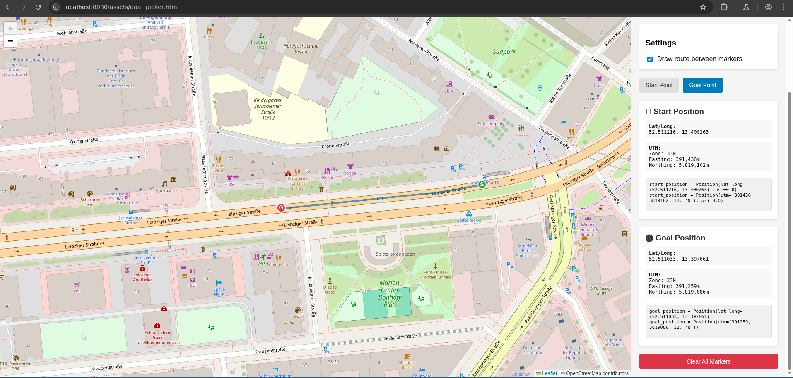

# Running a Scenario
This guide will walk through running and visualizing a scenario.
### Scenario Executions
1. Launch or attach to the `ADORe CLI` from the root of the `ADORe` repo:
```bash
make cli
```
2. `cd` to scenario directory:
```bash
cd adore_scenarios/simulation_scenarios
```
3. Launch a scenario:
```bash
ros2 launch simulation_test.py
```
### Scenario Visualization
> **ℹ️ INFO:**
> Visualization requires a chrome based browser (see: https://www.chromium.org/chromium-projects/) 
1. Start `lichtblick suite` aka `foxglove` aka `foxbox`. From the `ADORe` project root run:
```bash
cd tools/lichtblick
make build
make start
```
2. Run a scenario, launch or attach to the `ADORe CLI` from the root of the `ADORe` repo:
```bash
make cli
cd adore_scenarios/simulation_scenarios
ros2 launch simulation_test.py
```
3. Open lichtblick (in another shell):
```bash
chromium http://localhost:8080/\?ds\=foxglove-websocket\&ds.url\=ws://localhost:8765\&layout\=Default.json
```
or with a link:
[http://localhost:8080/?ds=foxglove-websocket&ds.url=ws://localhost:8765&layout=Default.json](http://localhost:8080/?ds=foxglove-websocket&ds.url=ws://localhost:8765&layout=Default.json)
Goal


### Goal position picking tool for a new scenario
1. Start `lichtblick suite` aka `foxglove` aka `foxbox`. From the `ADORe` project root run:
```bash
cd tools/lichtblick
make build
make start
```
2. Open the `goal_picker.html` (in another shell):
```bash
chromium http://localhost:8080/assets/goal_picker.html
```
or with a link:
[http://localhost:8080/assets/goal_picker.html](http://localhost:8080/assets/goal_picker.html)

The goal picker tool now displays both **UTM** and **Lat/Long** coordinates, which can be directly used with the Position class.

#### Goal Picking Tool




## Creating a Scenario: How to Create a Scenario File
This guide walks you through the steps to create a custom scenario file for simulation or testing purposes.
---
### 1. Copy an Existing Scenario
Start by copying any **working scenario file**. This ensures you have a valid structure and format to begin with.
```bash
cp existing_scenario.py my_custom_scenario.py
```
---
### 2. Get Start and Goal Coordinates
You can obtain coordinates using one of these methods:

**Method A: Google Maps**
- Use [Google Maps](https://maps.google.com) to select your **desired start point** and **goal point**.
- Right-click on the location and choose `What's here?`
- Copy the **latitude and longitude** for both start and goal points.

**Method B: Goal Picker Tool**
- Use the **goal_picker.html** tool (see Goal Position Picking section above) which provides both coordinate formats.
---
### 3. Define Positions Using the New Position Class
You can now define positions using either **Lat/Long** or **UTM** coordinates with the new Position class:

**Option A: Using Lat/Long coordinates**
```python
from scenario_helpers.simulated_vehicle import Position

start_position = Position(lat_long=(52.5200, 13.4050), psi=0.0)
goal_position = Position(lat_long=(52.5300, 13.4150))
```

**Option B: Using UTM coordinates**
```python
from scenario_helpers.simulated_vehicle import Position

start_position = Position(utm=(413176.0, 5819617.0, 33, 'N'), psi=0.0)
goal_position = Position(utm=(413276.0, 5819717.0, 33, 'N'))
```

**Option C: Legacy tuple format (still supported)**
```python
start_position = (413176.0, 5819617.0, 0.0)
goal_position = (413276.0, 5819717.0)
```

> **💡TIP:** The Position class automatically converts between coordinate systems, so you can use whichever format is most convenient for your source data.
---
### 4. Update Your Scenario File
Open your scenario file and update the position definitions:

```python
create_simulated_vehicle_nodes(
    namespace="vehicle_1",
    start_position=start_position,
    goal_position=goal_position,
    vehicle_id=1,
    map_file="your_map.xml",
    model_file="your_model.xml"
)
```
---
### 5. Set the Start Heading
The **start heading** (orientation in radians) can be critical for correct vehicle behavior:
- Try an initial value like `0.0` or `1.57` (90°).
- Adjust the heading using a **trial-and-error method** until the vehicle starts in the correct direction.
- The heading is specified as the `psi` parameter in the Position class or as the third element in the legacy tuple format.
---
✅ **Example Entries:**

**New Position class format:**
```python
start_position = Position(lat_long=(52.5200, 13.4050), psi=-3.23)
goal_position = Position(lat_long=(52.5300, 13.4150))
```

**Legacy tuple format:**
```python
start_position = (606529.67, 5797315.01, -3.23)
goal_position = (606447.98, 5797272.22)
```
---

For a complete example see the scenario: 
[simulation_scenarios/simulation_test.py](https://github.com/DLR-TS/adore_simulation_scenarios/blob/daa8f94402e19f3b22d5f12fc36126b783f75b50/simulation_test.py)


## 🔁 Final Check
Before running the scenario:
- ✅ Validate the file syntax.
- ✅ Make sure start and goal positions make sense visually.
- ✅ Run the simulation and fine-tune as needed.
- ✅ Test both coordinate formats to ensure compatibility.
---
